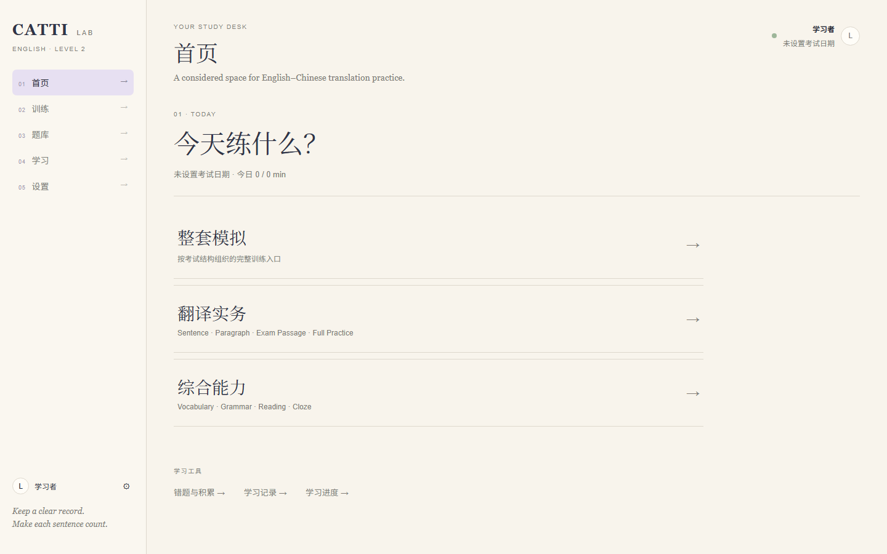
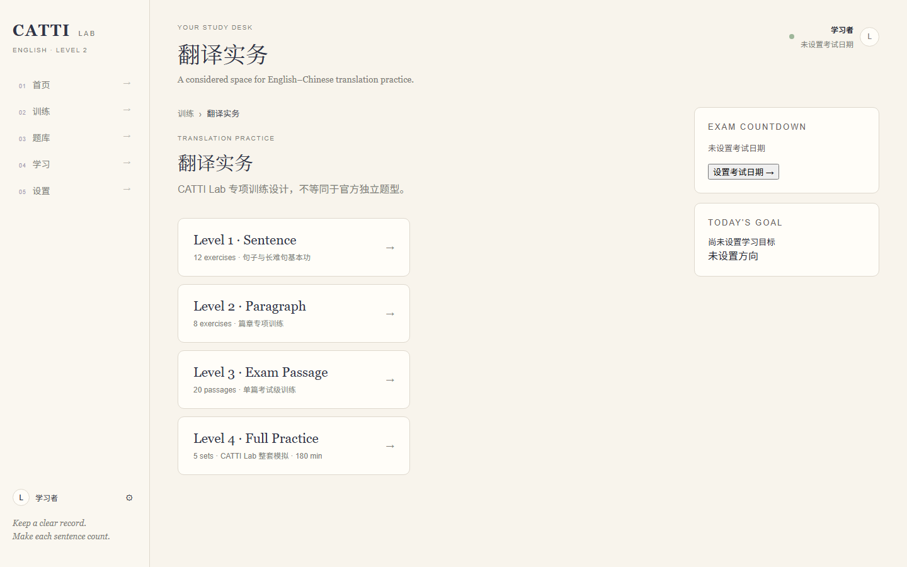
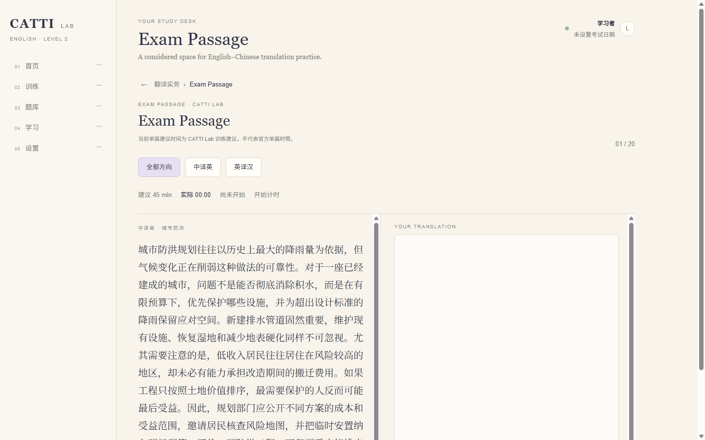
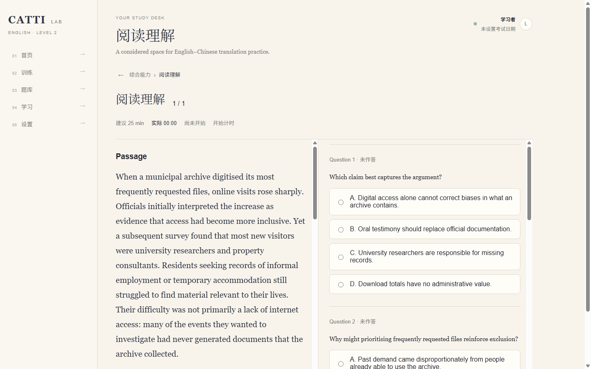
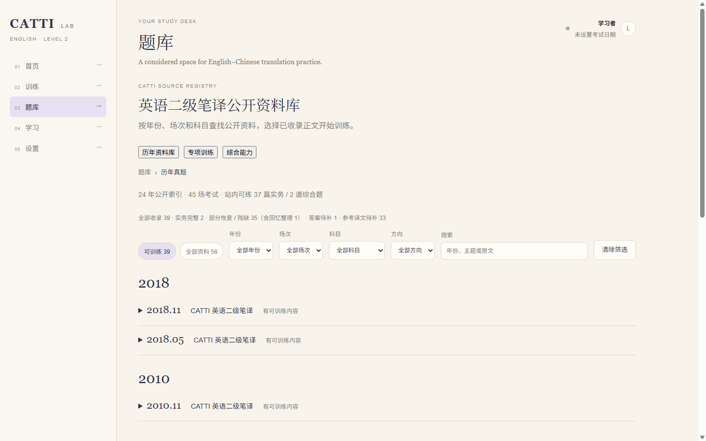
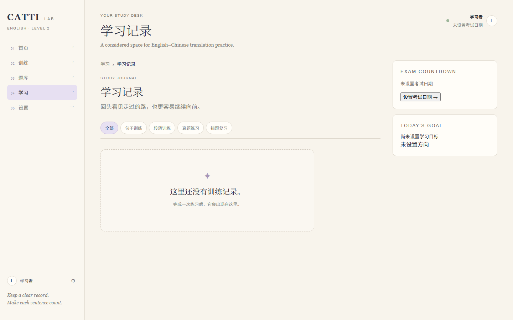

# CATTI Lab

面向 CATTI 英语二级笔译备考的训练与学习工作台。  
一个把专项练习、整套训练、学习记录和公开真题资料放在一起的安静工作空间。

[在线体验](https://catti-lab.672385493.workers.dev) · [项目截图](#项目截图) · [本地运行](#本地运行)

## 为什么做 CATTI Lab

CATTI 备考资料分散在不同来源，专项训练和整套训练常常彼此割裂，练习、计时与复盘也缺少统一流程。长篇翻译还容易陷入反复滚动、丢失上下文的作答体验。

CATTI Lab 尝试把这些环节组织成一个统一的训练工作台，让一次作答能够自然地进入记录、复盘和学习分析。

## 核心体验

首页从三个入口开始：

- **整套模拟**：按 CATTI Lab 的实务训练结构完成一组练习。
- **翻译实务**：进入 Sentence、Paragraph、Exam Passage 或 Full Practice。
- **综合能力**：进入 Vocabulary、Grammar、Reading 或 Cloze。

### Translation Practice

- **Sentence**：短句与长难句训练。
- **Paragraph**：中译英、英译汉段落训练，支持草稿、计时和参考译文。
- **Exam Passage**：考试级单篇翻译工作区。
- **Full Practice**：四篇实务训练的连续工作流。

长篇翻译使用 Split Workspace：左侧保留原文，右侧完成作答。计时器同时显示建议时长和实际用时；页面不会因为打开就开始计时，而是在首次有效作答时启动。草稿保存在本地，返回后可以继续。

### Comprehensive Ability

Vocabulary、Grammar、Reading、Cloze 分开组织。Reading 和 Cloze 使用左侧 Passage、右侧 Questions 的 Split View，提交后显示用户答案、正确答案与解析（当数据提供这些字段时）。

### Past Paper Library

题库同时区分公开资料索引（registry-only material）和已经恢复正文、可以训练的内容（trainable content）。部分恢复、回忆整理和来源待核验的资料会保留清晰的来源状态；系统不会把它们包装成完整官方历年真题库。没有参考译文的内容仍可训练，提交后会明确显示暂无人工参考译文。

## 产品决策

1. **长篇翻译采用 Split Workspace。** 原文与输入区并列，减少长文本作答时的上下文切换和反复滚动。
2. **计时从首次有效作答开始。** 页面停留时间不等于学习时间，因此打开页面不会自动计时。
3. **超过建议时长仍继续累计。** 超时信息被保留，记录反映真实完成时长，而不是在建议时间到达时截断。
4. **可训练正文优先于索引数量。** 资料只有标题和年份时仍保留在索引，但不会伪造题目正文；能恢复的部分先进入训练。
5. **Reading / Cloze 采用左文右题。** 做题时可以持续看到上下文，减少在 Passage 与题目之间来回寻找。
6. **用统一 Breadcrumb 返回。** 各训练页共享返回路径和信息层级，避免每个页面出现不同的返回按钮语义。

## Product Iteration & QA

这个版本经过多轮从产品问题出发的迭代：

`Demo dataset → 内容审计 → Training contract → 真题恢复 → Workspace 重构 → Browser E2E → Resume Demo Gate`

每轮同时检查代码契约和真实浏览器流程。技术检查通过并不代表产品流程已经通过，因此训练输入、提交、记录和刷新路径都需要单独验收。

## 数据与训练流程

```text
Exercise
   ↓
Workspace
   ↓
TrainingSession
   ↓
Study Records
   ↓
Analysis
```

TrainingSession 保存提交当下的 exercise snapshot、方向、用户答案、参考译文、实际用时和提交状态，因此历史记录不依赖之后重新读取题库来猜测当时的题目。

## 当前状态

**Resume Demo V1**

当前可用：

- 翻译专项：Sentence、Paragraph、Exam Passage、Full Practice
- 综合能力专项：Vocabulary、Grammar、Reading、Cloze
- Past Paper Library 与可训练正文
- 建议时长、实际计时与草稿恢复
- Study Records
- Basic Analysis
- 本地 Profile、收藏、错题与学习记录

这是一个可直接体验和继续迭代的简历演示版本，不是已经完成商业化运营准备的产品。

## Roadmap

以下能力不属于当前已上线能力：

- AI grading 与翻译修改建议
- AI continuous generation
- 错题智能复习
- Advanced Analysis
- Desktop Pet / Companion
- 更多公开 Past Papers 的恢复与核验
- 账户系统与云同步
- Visual V3

## 技术栈

- React
- Vite
- JavaScript
- localStorage
- Cloudflare Workers / Static Assets
- GitHub

## 项目截图

截图来自线上 Demo，使用无个人数据的全新浏览器会话。

### 首页



### 翻译实务入口



### Exam Passage Workspace



### Reading Split View



### Past Paper Library



### Study Records



## 本地运行

```bash
git clone https://github.com/summersea412/catti-lab.git
cd catti-lab
npm install
npm run dev
```

构建与检查：

```bash
npm run build
npm test
npm run content:check
```


## Production deployment — 唯一正式环境

CATTI Lab 唯一正式生产环境是现有 Cloudflare Worker **catti-lab**：
https://catti-lab.672385493.workers.dev

“部署 / 更新线上版本”默认只更新这个 Worker。不创建新的 Worker、Pages 项目或替代 URL；不使用历史 `.openai/hosting.json` 向 chatgpt.site 发布。

正式工作目录：`D:\projects\catti\catti-study-assistant`，正式分支：`main`。旧 `D:\catti-study-assistant-v2` 不作为部署来源。

部署使用 Workers Static Assets。根目录 `wrangler.jsonc` 指定 `dist`、现有 Worker 名称、`2026-09-18` compatibility date 和 `single-page-application` 回退。学习分析直接地址为 `/analysis`；`/vocabulary` 等前端路由可直接访问和刷新。

```powershell
npx.cmd wrangler whoami
npx.cmd wrangler deployments status --name catti-lab
npm run build
npx.cmd wrangler deploy --config wrangler.jsonc --name catti-lab --dry-run
npx.cmd wrangler deploy --config wrangler.jsonc --name catti-lab
```

部署前核对 main 提交、构建成功和现有 Worker 名称；若账号不匹配或 Worker 不存在，停止，不创建替代资源。登录使用本机 Wrangler OAuth，不将 Token、OAuth 凭据或 Account ID 写入仓库。部署后核对返回地址、版本 ID，并在正式 URL 验证页面和刷新行为。
